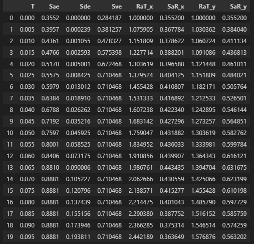

This repo aims to calculate the topics in TS500-2000 and TSC2018 by coding them with Python.

# Todo list
- [x] Design of confining reinforcement in rectangular columns according to TSC2018 .
- [x] Creation of the steel model with the confined and unconfined mander concrete model specified in ANNEX 5-A of the TSC2018.
- [x] Creating the spectrum graphs given in section 3  of the TSC2018.
- [x] Finding the building height class (BYS) and the maximum possible building height according to the information given.
- [x] Connection with Etabs(CSI product) program and getting results
- [x] Calculation of strength and ductility increase in columns confined with fibrous polymer
- [ ] Interstory drift check according to TSC2018
- [ ] Earthquake record selection, acceleration record reading, spectral acceleration, velocity and displacement series extraction and scaling operations.
- [ ] Finding performance targets based on the information provided according to TSC2018
- [ ] Recommendation of R and D coefficients in accordance with TSC2018.
- [ ] Finding equivalent lateral loads according to TSC2018.
- [ ] External forces in cantilever retaining walls according to TBDY2018.


# Summary of repo


# 💬 Contact

<a href="https://twitter.com/SuralMuhammet" target="_blank">
  
</a>

<a href="https://www.linkedin.com/in/muhammedsural/" target="_blank">

</a>

<a href="mailto:muhammedsural@gmail.com" target="_blank">

</a> 

# Installing

You can install using pip:

`pip install TSC2018-Design`


# Example

## 1- Importing modules

```python
from TSCMaterialModels import Mander
from TSCConfimentBarsRules import ConfimentDesign as cd
from Definitions import DuctilityLevel, ResSystemType, SlabSystem,SeismicResistanceBuildingsClass
from TSCResponseSpectra import *
```

## 2- Inputs

```python
"""Units N,mm"""
Nd                      = 16000 
B                       = 400
H                       = 400
s                       = 80
TieRebarDiameter        = 8
LongnitRebarDiameter    = 14
ClearCoverConc          = 25
NumBarsTop              = 2
NumBarsInterior         = 1
NumBarsBot              = 2
X_tiebars               = 2
Y_tiebars               = 3
fsy                     = 220
fywe                    = 220
eps_su                  = 0.08
f_co                    = 25
f_ce                    = 25
Fctd                    = 10
Ln                      = 2600
```

## 3- TSC2018 rectangular column confinement reinforcement design

```python
ConfinmentDesign = cd(Nd, fsy, Fctd, Ln, B, H, ClearCoverConc, X_tiebars, Y_tiebars, f_co, fywe, TieRebarDiameter, LongnitRebarDiameter)
```
Kolon Serbest Bölgesindeki Etriye Adeti - Etriye Çapi / SarılmaDışıAralık / OrtaSarılmadakiAralık / UçSarılmaAralık = 42 - ∅8 / 16 / 5 / 5

```python
s = ConfinmentDesign.s_OptEndConfArea
```
52

## 4- Material models of TSC2018

```python
mander = Mander(B                    = B,
                H                    = H,
                s                    = s,
                TieRebarDiameter     = TieRebarDiameter,
                LongnitRebarDiameter = LongnitRebarDiameter,
                ClearCoverConc       = ClearCoverConc,
                NumBarsTop           = NumBarsTop,
                NumBarsInterior      = NumBarsInterior,
                NumBarsBot           = NumBarsBot,
                X_tiebars            = X_tiebars,
                Y_tiebars            = Y_tiebars,
                fsy                  = fsy,
                f_ywe                = fywe,
                eps_su               = eps_su,
                f_co                 = f_co,
                f_ce                 = f_ce
                )

mander.Plot_Manders()
```


## 5-Creating target spectrum according to TSC2018
To obtain the spectra given in TBDY2018, we use the `SeismicInputs` class for seismic inputs. For seismic recording input, an instance of our `SeismicInputs` sample class is purchased. This class will also be used in other classes.

```python
SeismicVariables = SeismicInputs(lat = 39.85,lon = 30.2,soil = "ZC",intensity = "DD2")
SeismicVariables
```
<p>Latitude :39.85</p>
<p>Longitude :30.2</p>
<p>Soil Class :ZC</p>
<p>Intensity:DD2</p>

We provide information about the building model in the `SeismicResistanceBuildingInputs` class. Here we used `DuctilityLevel`, `ResSystemType`, `SlabSystem` which are `Enum` classes for classifications.

```python
RCBuilding = SeismicResistanceBuildingInputs(Hn=70,
                                                 I=1,
                                                 DuctilLevel=DuctilityLevel.Yuksek,
                                                 ResSystemType_X=ResSystemType.BAKarma,
                                                 ResSystemType_Y=ResSystemType.BAKarma,
                                                 SlabSystem=SlabSystem.Plak_kirisli)
RCBuilding
```

<p>Hn :70</p>
<p>I :1</p>
<p>DuctilLevel :Yuksek</p>
<p>ResSystemType_X :BAKarma</p>
<p>ResSystemType_Y :BAKarma</p>
<p>SlabSystem :Plak_kirisli</p>

`SeismicInputsManager` class is used to find spectrum values. This class uses the information of the `SeismicVariables` class as input and calculates the other values if the `SetVariables` function is run and sets them to the class properties.

```python
SIM = SeismicInputsManager(SeismicVariables=SeismicVariables, TL=6.0)
SIM.SetVariables()
SIM
```

Ss :0.737
S1 :0.195
PGA :0.309
PGV :18.833
Fs :1.205
F1 :1.5
SDs :0.888085
SD1 :0.2925
TA :0.06587207305607008
TB :0.3293603652803504
TL :6.0

`SeismicResistanceBuildingManeger` class takes `SeismicResistanceBuildingInputs`, which contains building information, and `SeismicInputsManager` classes, which calculate seismic data, as input, and calculates general building classification operations by running the `SetVariables` function and sets properties.

```python
Srbm = SeismicResistanceBuildingManeger(BuildingVariables=RCBuilding, SeismicManager=SIM, BuildingClass=SeismicResistanceBuildingsClass.A14, Rx=6,Ry=3)
Srbm.SetVariables()
Srbm
```

SeismicResistanceBuildingManeger(BuildingVariables=Hn :70
I :1
DuctilLevel :Yuksek
ResSystemType_X :BAKarma
ResSystemType_Y :BAKarma
SlabSystem :Plak_kirisli, SeismicManager=Ss :0.737
S1 :0.195
PGA :0.309
PGV :18.833
Fs :1.205
F1 :1.5
SDs :0.888085
SD1 :0.2925
TA :0.06587207305607008
TB :0.3293603652803504
TL :6.0, BuildingClass=<SeismicResistanceBuildingsClass.A14: 5>, Total_M_DEV=0, Total_M_o=0, DTS=2, BYS=2, Rx=6, Ry=3, Dx=1.0, Dy=1.0)

The `Spectrum` class calculates the spectrum information of the structure by running the `SetVariables` function using the `SeismicResistanceBuildingManeger` class and sets it to the `ElasticSpectrums` variable. This property returns `pandas.DataFrame`.

```python
Spec = Spectrum(BuildingManager=Srbm)
Spec.SetVariables()
Spec
```

Spectrum(BuildingManager=SeismicResistanceBuildingManeger(BuildingVariables=Hn :70
I :1
DuctilLevel :Yuksek
ResSystemType_X :BAKarma
ResSystemType_Y :BAKarma
SlabSystem :Plak_kirisli, SeismicManager=Ss :0.737
S1 :0.195
PGA :0.309
PGV :18.833
Fs :1.205
F1 :1.5
SDs :0.888085
SD1 :0.2925
TA :0.06587207305607008
TB :0.3293603652803504
TL :6.0, BuildingClass=<SeismicResistanceBuildingsClass.A14: 5>, Total_M_DEV=0, Total_M_o=0, DTS=2, BYS=2, Rx=6, Ry=3, Dx=1.0, Dy=1.0))

```python
Spec.ElasticSpectrums
Spec
```



The `plot_Spectrums` function can be run to display all plots simultaneously. Graphs are drawn in one piece in a specially prepared format.

```python
Spec.plot_Spectrums()
```


Functions in related classes can be used individually. For example, elastic and reduced elastic spectrum values for a certain period can be obtained with the help of the following functions.

```python
Sae_Tp = Spec.Get_Sae_Tp(T=1.2,
                         TA = Spec.BuildingManager.SeismicManager.TA,
                         TB = Spec.BuildingManager.SeismicManager.TB,
                         SDs= Spec.BuildingManager.SeismicManager.SDs,
                         SD1= Spec.BuildingManager.SeismicManager.SD1,
                         TL = Spec.BuildingManager.SeismicManager.TL 
                         )
Sae_Tp
```

0.2438

```python
Sar_Tp = Spec.Get_SaR_Tp(R  = Spec.BuildingManager.Rx,
                         D  = Spec.BuildingManager.Dx,
                         T  = 1.2,
                         TB = Spec.BuildingManager.SeismicManager.TB,
                         I  = Spec.BuildingManager.BuildingVariables.I,
                         TA = Spec.BuildingManager.SeismicManager.TA,
                         SDs= Spec.BuildingManager.SeismicManager.SDs,
                         SD1= Spec.BuildingManager.SeismicManager.SD1,
                         TL = Spec.BuildingManager.SeismicManager.TL  )
Sar_Tp
```

0.0406

