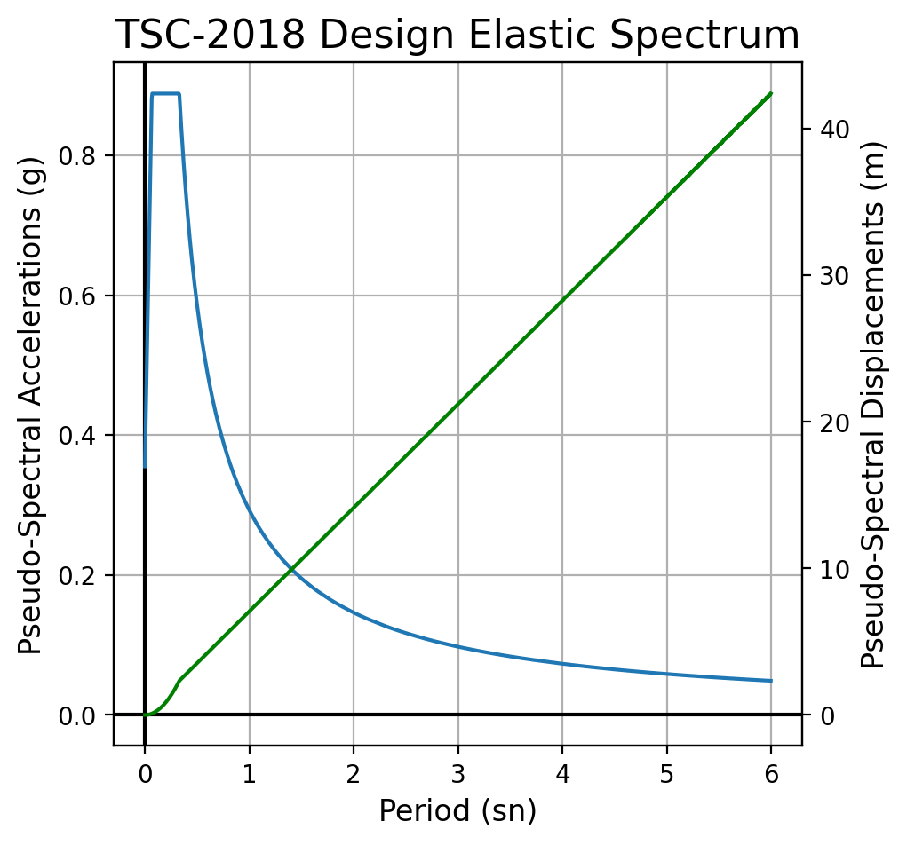
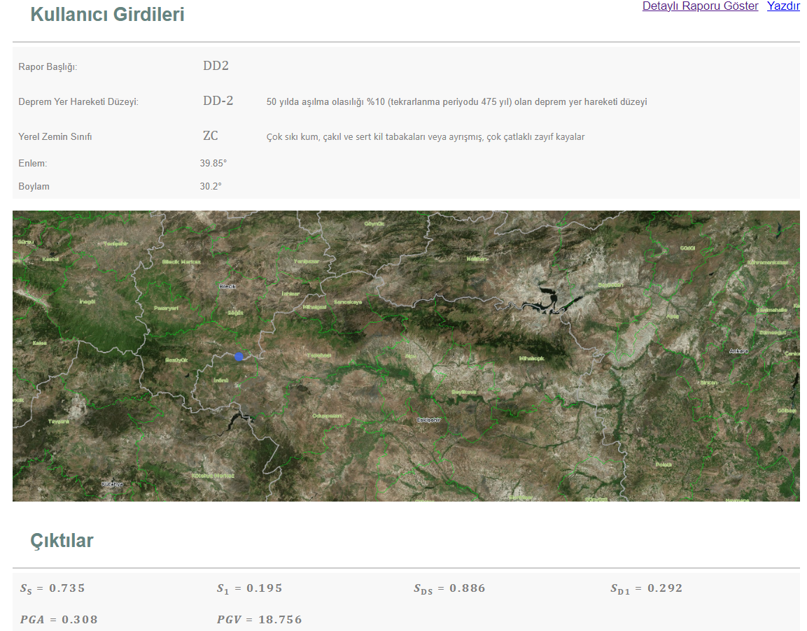

Bu repoda TS500 ve TBDY2018 deki konuların python yardımı ile kodlaması yapılarak hesaplanması amaçlanmaktadır.

- [x] Dikdörtgen kolonlarda sargı donatısı tasarımı.
- [x] TBDY-2018 deprem yönetmeliğinde EK5-A da belirtilen sargılı ve sargısız mander beton modeli ile çelik modelinin python yardımı ile oluşturulması.
- [x] TBDY2018 bölüm 3'te verilen spektrum grafiklerinin çıkarılması.
- [ ] Verilen bilgilere göre BYS sınıfı ve yapılabilecek maximum bina yüksekliğinin bulunması
- [ ] Verilen bilgilere göre performans hedeflerinin bulunması
- [ ] TBDY2018' e uygun R ve D katsayıları önermesi

# Örnek Çalışma

## 1- Modüllerin import edilmesi

```python
from TSCMaterialModels import Mander
from TSCConfimentBarsRules import ConfimentDesign as cd
```

## 2- Kullanılacak değerler

```python
"""Units N,mm"""
Nd                      = 16000 
B                       = 400
H                       = 400
s                       = 80
TieRebarDiameter        = 8
LongnitRebarDiameter    = 14
ClearCoverConc          = 25
NumBarsTop              = 2
NumBarsInterior         = 1
NumBarsBot              = 2
X_tiebars               = 2
Y_tiebars               = 3
fsy                     = 220
fywe                    = 220
eps_su                  = 0.08
f_co                    = 25
f_ce                    = 25
Fctd                    = 10
Ln                      = 2600
```

## 3- TBDY2018 dikdörtgen kolon sargı donatısı tasarımı

```python
ConfinmentDesign = cd(Nd, fsy, Fctd, Ln, B, H, ClearCoverConc, X_tiebars, Y_tiebars, f_co, fywe, TieRebarDiameter, LongnitRebarDiameter)
```
Kolon Serbest Bölgesindeki Etriye Adeti - Etriye Çapi / SarılmaDışıAralık / OrtaSarılmadakiAralık / UçSarılmaAralık = 42 - ∅8 / 16 / 5 / 5

```python
s = ConfinmentDesign.s_OptEndConfArea
```
52

## 3- TBDY2018 malzeme modelleri

```python
mander = Mander(B                    = B,
                H                    = H,
                s                    = s,
                TieRebarDiameter     = TieRebarDiameter,
                LongnitRebarDiameter = LongnitRebarDiameter,
                ClearCoverConc       = ClearCoverConc,
                NumBarsTop           = NumBarsTop,
                NumBarsInterior      = NumBarsInterior,
                NumBarsBot           = NumBarsBot,
                X_tiebars            = X_tiebars,
                Y_tiebars            = Y_tiebars,
                fsy                  = fsy,
                f_ywe                = fywe,
                eps_su               = eps_su,
                f_co                 = f_co,
                f_ce                 = f_ce
                )

mander.Plot_Manders()
```


## TBDY2018 Hedef Spektrumların Elde Edilmesi
TBDY2018 de verilen spektrumları elde etmek için sismik girdiler için oluşturulan `SeismicInputs` sınıfından faydalanıyoruz. Bu sınıfı spektrum değerlerini hesaplaması için oluşturulmuş `SeismicTSC` sınıfının girdisi olarak verildiğinde tüm değerler hesaplanmış olacak.
```python
SeismicVariables = SeismicInputs(lat        = 39.85, 
                                 lon        = 30.2, 
                                 soil       = "ZC", 
                                 intensity  = "DD2",
                                 R          = 8.0,
                                 D          = 3.0,
                                 I          = 1.0)
rs = SeismicTSC(Variables = SeismicVariables)
rs.plot_HorizontalElasticSpectrum()
```


`SeismicTSC` içerisindeki `ElasticSpectrums` değişkeninden periyotlar,spektral ivmeler, spektral deplasmanlar,düşey spektral ivmeler, deprem yükü azaltma katsayıları ve azaltılmış spektral ivmeleri içeren pandas DataFrame yapısına erişilebilir.
```python
rs.ElasticSpectrums.head(10)
```


Bu sınıfın referansını `SeismicTSC` sınıfına girdi olarak verdiğimizden dolayı bu referans üzerinden hesaplanan tüm değerler `SeismicVariables` sınıfında da saklanmış olur. Formatlanmış bir şekilde tüm sismik girdiler görüntülenebilir.
```python
SeismicVariables
```


Afaddan alınan gerçek değerler aşağıdaki gibidir. Yaklaşık olarak hesaplanan değerlere çok yakın çıkmaktadır.
